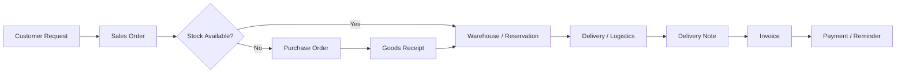

# Process Landscape

## Purpose

This document describes the main business processes that need to be covered by the ERP.

The first assumption is that most processes are standard for a small German trading and logistics company.

## High-level process areas

| Area | Description | ERP priority |
|---|---|---|
| Sales / Auftrag | Customer orders and confirmations | High |
| Purchasing / Bestellung | Supplier orders and purchase prices | High |
| Pricing / Kalkulation | EK, VK, margin and transport cost calculation | High |
| Warehouse / Lager | Stock, goods receipt, movements, corrections | High |
| Logistics / Disposition | Own trucks, external carriers, deliveries | High |
| Documents | Order confirmation, delivery note, invoice, reminders | High |
| Finance | Invoice status, payments, receivables | Medium |
| Commissions | Representatives and commission logic | Medium |
| Reporting | Operational reports and management overview | Medium |

## First process map

## Open questions

- Which processes are currently handled in Minisys?
- Which processes can be replaced by standard ERPNext workflows?
- Which logistics steps are unique enough to require customization?
